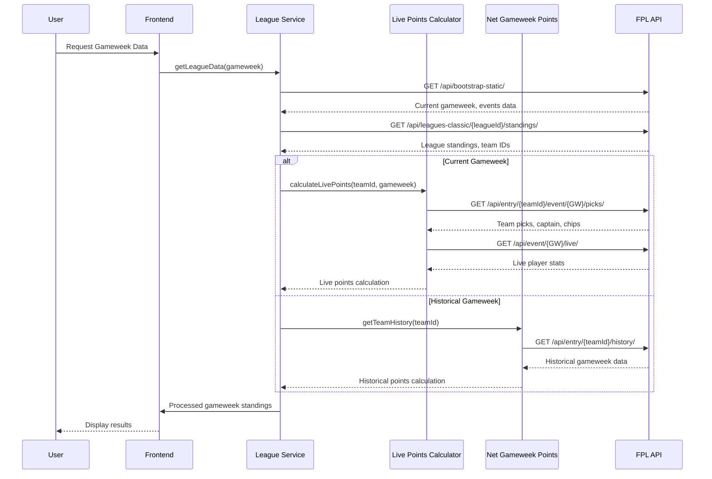
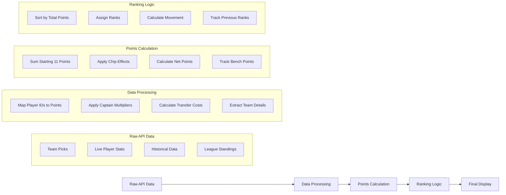
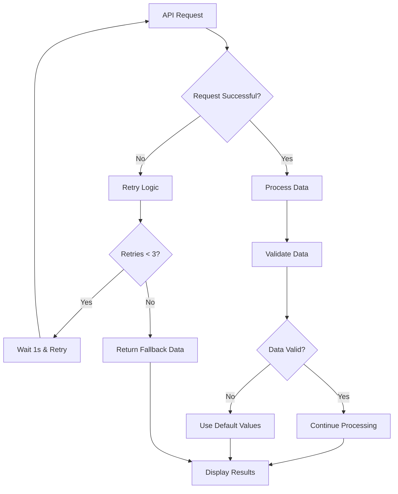
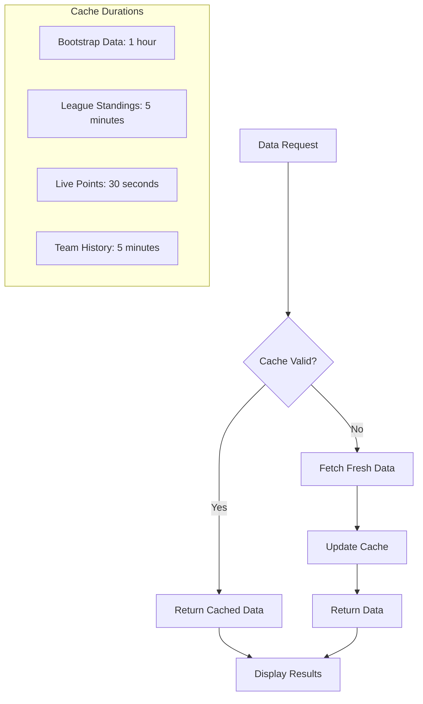

# FPL Gameweek Points Calculation - Process Flow Diagram

## Complete Business Process Flow

```mermaid
graph TD
    %% User Interaction
    A[User Requests Gameweek Data] --> B[Get Current Gameweek]
    
    %% Initial Setup
    B --> C[Fetch Bootstrap Data]
    C --> D[Extract Current Gameweek ID]
    D --> E[Fetch League Standings]
    E --> F[Extract Team IDs from League]
    
    %% Decision Point
    F --> G{Is Current Gameweek?}
    
    %% Live Points Path (Current Gameweek)
    G -->|Yes| H[Fetch Live Points Data]
    G -->|No| I[Fetch Historical Data]
    
    %% Live Points Calculation
    H --> J[Fetch Team Details for All Teams]
    J --> K[Fetch Live Standings]
    K --> L[Create Live Points Map]
    L --> M[Process Each Team's Picks]
    M --> N[Apply Captain Multipliers]
    N --> O[Calculate Transfer Costs]
    O --> P[Calculate Net Points]
    
    %% Historical Data Path
    I --> Q[Fetch Team History for All Teams]
    Q --> R[Find Specific Gameweek Data]
    R --> S[Extract Historical Points]
    S --> T[Calculate Historical Net Points]
    
    %% Data Processing
    P --> U[Process Team Details]
    T --> U
    U --> V[Get Captain Names]
    V --> W[Track Active Chips]
    W --> X[Calculate Rankings]
    
    %% Final Processing
    X --> Y[Sort by Total Points]
    Y --> Z[Assign Current Ranks]
    Z --> AA[Calculate Rank Movement]
    AA --> BB[Display Results]
    
    %% Subgraphs for Detailed Processes
    subgraph "Live Points Calculation Process"
        H1[GET /api/bootstrap-static/] --> H2[GET /api/event/{GW}/live/]
        H2 --> H3[GET /api/entry/{teamId}/event/{GW}/picks/]
        H3 --> H4[Map Player Points to Team Picks]
        H4 --> H5[Apply Captain/Vice-Captain Multipliers]
        H5 --> H6[Sum Starting 11 Points]
    end
    
    subgraph "Historical Data Process"
        I1[GET /api/entry/{teamId}/history/] --> I2[Find Gameweek in History]
        I2 --> I3[Extract Points & Transfer Costs]
        I3 --> I4[Calculate Net Points]
    end
    
    subgraph "API Endpoints Used"
        EP1["GET /api/bootstrap-static/"]
        EP2["GET /api/leagues-classic/{leagueId}/standings/"]
        EP3["GET /api/entry/{teamId}/history/"]
        EP4["GET /api/event/{gameweekId}/live/"]
        EP5["GET /api/entry/{teamId}/event/{gameweekId}/picks/"]
    end
    
    subgraph "Data Structures"
        DS1["TeamPick: {element, position, multiplier, is_captain}"]
        DS2["LiveStandingsElement: {id, stats: {total_points, ...}}"]
        DS3["GameweekHistory: {event, points, event_transfers_cost}"]
        DS4["GameweekStanding: {entry, event_total, net_points, rank}"]
    end
    
    subgraph "Points Calculation Logic"
        PC1["Live Points = Player Points × Captain Multiplier"]
        PC2["Net Points = Gross Points - Transfer Costs"]
        PC3["Captain = 2× Points, Triple Captain = 3× Points"]
        PC4["Bench Boost = All 15 Players Count"]
    end
```

## Detailed API Flow Diagram



## Points Calculation Components

### 1. Live Points Calculator (`live-points-calculator.ts`)
```typescript
// Core calculation logic
const livePoints = livePointsMap.get(pick.element) || 0;
const points = livePoints * pick.multiplier; // Captain = 2x, Triple Captain = 3x
```

### 2. Net Points Calculator (`net-gameweek-points.ts`)
```typescript
// Net points calculation
const netPoints = gameweekData.points - gameweekData.event_transfers_cost;
```

### 3. League Service (`league-service.ts`)
```typescript
// Orchestrates all calculations
const event_total = isCurrentGameweek 
  ? (livePointsMap.get(teamIds[index]) || gameweekData.points)
  : gameweekData.points;

const net_points = event_total - transferCost;
```

## Data Transformation Flow



## Error Handling and Fallbacks



## Cache Strategy



## Key Business Rules

1. **Captain Points**: Automatically doubles captain's points
2. **Triple Captain**: Triples captain's points (chip effect)
3. **Bench Boost**: All 15 players count towards total
4. **Transfer Costs**: Deducted from net points calculation
5. **Live vs Historical**: Different calculation methods based on gameweek status
6. **Ranking**: Based on total points, with tie-breakers
7. **Movement**: Calculated against previous gameweek rankings

This comprehensive flow ensures accurate, real-time gameweek points calculation for the FPL mini-league analysis system. 